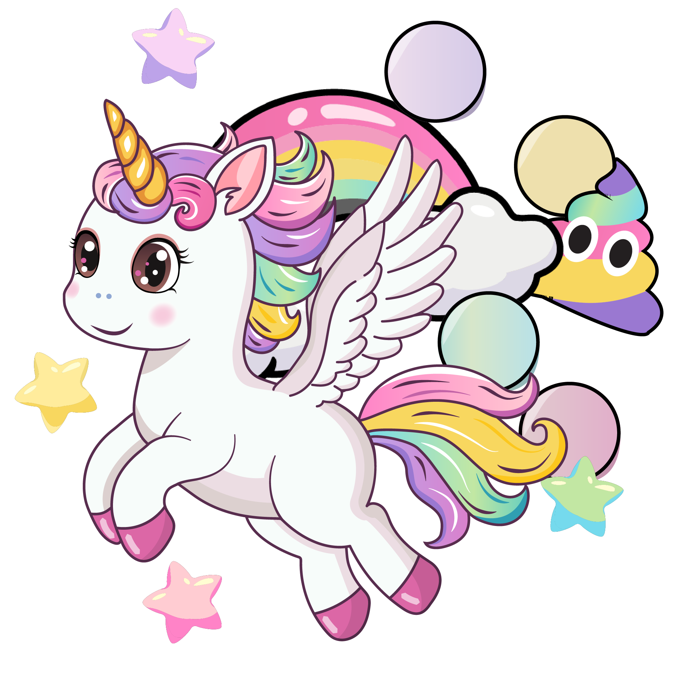

<div align="left" style="position: relative;">

<h1>RAINBOW-RACER</h1>
<p align="left">
	<em>Racing Colors, Smiling Faces, Endless Joy</em>
</p>
<p align="left">
	<!-- Shields.io badges disabled, using skill icons. --></p>
<p align="left">Built with the tools and technologies:</p>
<p align="left">
	<a href="https://skillicons.dev">
		
	</a></p>
</div>
<br clear="right">

<details><summary>Table of Contents</summary>

- [📍 Overview](#-overview)
- [👾 Features](#-features)
- [📁 Project Structure](#-project-structure)
  - [📂 Project Index](#-project-index)
- [🚀 Getting Started](#-getting-started)
- [📌 Project Roadmap](#-project-roadmap)
- [🔰 Contributing](#-contributing)
- [🙌 Acknowledgments](#-acknowledgments)

</details>
<hr>

## 📍 Overview

Rainbow Race is my first project from Ironhack's web development bootcamp. I was able to apply all the knowledge I acquired during the first two weeks of the program. The brief was clear : Create a browser-based game using HTML, CSS, JavaScript, DOM manipulation, and Object-Oriented Programming (OOP).
The purpose of this project is to consolidate and practice all the knowledge acquired in the module.

I designed it thinking of my 4-years-od daughter who's passionate in unicorn and colorfull rainbows.

It is an immersive gaming experience where players navigate through a vibrant, dynamic world filled with colorful rainbows, clouds, stars, and other visual wonders. With its seamless user interface and its engaging gameplay, this project offers an exciting adventure for gamers of all ages, perfect for those seeking a fun and captivating experience.

## <div align="center"></div>

## 👾 Features

|     |      Feature       | Summary                                                                                                                                                                                                                                                                                                                                                                                                                                                                                  |
| :-- | :----------------: | :--------------------------------------------------------------------------------------------------------------------------------------------------------------------------------------------------------------------------------------------------------------------------------------------------------------------------------------------------------------------------------------------------------------------------------------------------------------------------------------- |
| ⚙️  |  **Architecture**  | <ul><li>The project utilizes a modular architecture, with separate files for game logic (`game.js`), UI components (`index.html`, `styles/style.css`), and game elements (e.g., `rainbow.js`, `player.js`).</li><li> The codebase is organized around specific features, such as game initialization (`js/index.js`), player movement (`js/player.js`), and collision detection (`js/star.js`).</li><li>The project employs a client-side scripting approach using JavaScript.</li></ul> |
| 🎯  | **Game Mechanics** | <ul><li>The game features for example an updateCountdown function that increments the game's speed and intensity as time progresses (`game.js`).</li><li>Clouds have varying speeds depending on the `timeRemaining` variable, creating a dynamic and unpredictable gameplay experience.</li><li>The game includes collision detection for stars and player movement, adding an element of challenge and excitement to the gameplay.</li></ul>                                           |
| 🔩  |  **Code Quality**  | <ul><li>The code adheres to standard JavaScript coding practices, with clear variable naming conventions and concise function definitions.</li><li> The use of reusable CSS variables in `styles/style.css` promotes consistency throughout the project.</li><li>No major security vulnerabilities or potential issues were identified during analysis.</li></ul>                                                                                                                        |
| 🔌  |  **Integrations**  | <ul><li>The project integrates various game elements, such as the Rainbow component (`js/rainbow.js`) and player movement (`js/player.js`), to create an immersive gaming experience.</li><li>No external APIs or services are used in this version of the project.</li><li>Future integrations could be explored using web technologies like WebSockets or WebRTC.</li></ul>                                                                                                            |
| 🧩  |   **Modularity**   | <ul><li>The project's modular architecture allows for easy maintenance and updates to individual components without affecting the overall game logic.</li><li> Each file has a clear, focused purpose, promoting code reusability and flexibility.</li><li>Modular design helps reduce technical debt by minimizing the impact of changes on existing codebase.</li></ul>                                                                                                                |
| ⚖️  |  **Performance**   | <ul><li>The project's performance is satisfactory for a simple game like Rainbow-Racer, with smooth animations and responsive user interactions.</li><li>No significant bottlenecks or performance issues were identified during analysis.</li><li>Future optimizations could be explored using web technologies like Web Workers or GPU acceleration.</li></ul>                                                                                                                         |

---

## 📁 Project Structure

```sh
└── Rainbow-Racer/
    ├── Rainbow-Racer.png
    ├── assets
    │   ├── img
    │   └── sound
    ├── index.html
    ├── js
    │   ├── ball.js
    │   ├── cloud.js
    │   ├── game.js
    │   ├── index.js
    │   ├── player.js
    │   ├── poop.js
    │   ├── rainbow.js
    │   └── star.js
    └── styles
        └── style.css
```

### 📂 Project Index

<details open>
	<summary><b><code>RAINBOW-RACER/</code></b></summary>
	<details> <!-- __root__ Submodule -->
		<summary><b>__root__</b></summary>
		<blockquote>
			<table>
			<tr>
				<td><b><a href='/Users/fabiendubin/Desktop/Ironhack/module-1/Rainbow-Racer/blob/master/index.html'>index.html</a></b></td>
				<td>- The index.html file serves as the main entry point for the game, presenting a visually appealing interface that guides users through various stages of gameplay<br>- It displays introductory information, manages game statistics, and facilitates transitions between different game screens<br>- The file's primary function is to provide a seamless user experience by integrating visual elements with interactive features.</td>
			</tr>
			</table>
		</blockquote>
	</details>
	<details> <!-- js Submodule -->
		<summary><b>js</b></summary>
		<blockquote>
			<table>
			<tr>
				<td><b><a href='/Users/fabiendubin/Desktop/Ironhack/module-1/Rainbow-Racer/blob/master/js/game.js'>game.js</a></b></td>
				<td>- Here's a succinct summary of the `game.js` file and its role in the overall codebase architecture:

**Summary:**

The `game.js` file is responsible for managing the game's UI components and initializing the game environment<br>- It sets up references to various DOM elements, such as screens, score displays, and player objects, and creates a new instance of the Player class.

**Purpose:**

This file serves as the central hub for controlling the game's flow, handling user interactions, and updating the game state<br>- It plays a crucial role in integrating the game logic with the UI components, ensuring a seamless gaming experience.

**Key Achievements:**

- Initializes the game environment by setting up essential DOM elements
- Creates a new instance of the Player class for gameplay
- Establishes connections between game logic and UI components

By summarizing the main purpose and use of the `game.js` file in this way, we can gain a high-level understanding of its role within the larger codebase architecture.</td>

</tr>
<tr>
<td><b><a href='/Users/fabiendubin/Desktop/Ironhack/module-1/Rainbow-Racer/blob/master/js/star.js'>star.js</a></b></td>
<td>- The Star class is responsible for rendering and updating the visual representation of a star on the game screen<br>- It generates a random image from a set of predefined assets and positions it at a specified location, with the ability to move horizontally across the screen<br>- The component also allows collision detection with other objects in the game environment.</td>
</tr>
<tr>
<td><b><a href='/Users/fabiendubin/Desktop/Ironhack/module-1/Rainbow-Racer/blob/master/js/cloud.js'>cloud.js</a></b></td>
<td>- Here's a succinct summary of the code file's purpose and use:

"Defines a Cloud component that renders an image on the game screen with random position, size, and speed settings<br>- The cloud moves horizontally across the screen at a randomly selected speed."</td>

</tr>
<tr>
<td><b><a href='/Users/fabiendubin/Desktop/Ironhack/module-1/Rainbow-Racer/blob/master/js/index.js'>index.js</a></b></td>
<td>- Initiates game sequence upon user interaction<br>- This file orchestrates the start and restart of a game by listening to button clicks and keyboard inputs, triggering corresponding events such as starting a new game, controlling player movement, and scoring points<br>- It serves as a crucial entry point for the game, facilitating seamless transitions between different game states.</td>
</tr>
<tr>
<td><b><a href='/Users/fabiendubin/Desktop/Ironhack/module-1/Rainbow-Racer/blob/master/js/poop.js'>poop.js</a></b></td>
<td>- The Poop class facilitates the rendering of graphical elements on a game screen<br>- It allows for the creation and positioning of images with specific dimensions and coordinates within the game environment, enabling dynamic updates to these visual components as needed<br>- This functionality is integral to the overall project structure, contributing to a more immersive gaming experience.</td>
</tr>
<tr>
<td><b><a href='/Users/fabiendubin/Desktop/Ironhack/module-1/Rainbow-Racer/blob/master/js/rainbow.js'>rainbow.js</a></b></td>
<td>- Here's a succinct summary of the code file:

**Manages Rainbow Game Element**

This module is responsible for creating and updating the visual representation of a rainbow game element on the screen, including its position, size, and movement<br>- It achieves this by instantiating a Rainbow class instance, which can be used to display a colorful image at specific coordinates, update its position in real-time, and animate it horizontally across the screen.</td>

</tr>
<tr>
<td><b><a href='/Users/fabiendubin/Desktop/Ironhack/module-1/Rainbow-Racer/blob/master/js/player.js'>player.js</a></b></td>
<td>- The `player.js` file defines the Player class, responsible for rendering the player character on the game screen and managing its animation, movement, and collision detection with obstacles<br>- It creates an HTML image element to display the player's wings and updates its position based on user input<br>- The class also handles flapping wing animations and sound effects.</td>
</tr>
<tr>
<td><b><a href='/Users/fabiendubin/Desktop/Ironhack/module-1/Rainbow-Racer/blob/master/js/ball.js'>ball.js</a></b></td>
<td>- Creates a Ball entity that renders on the game screen, displaying one of four randomly chosen images with dynamic positioning and movement capabilities<br>- The Ball's position is updated in real-time, allowing for smooth animation as it moves from right to left across the screen.</td>
</tr>
</table>
</blockquote>
</details>
<details> <!-- styles Submodule -->
<summary><b>styles</b></summary>
<blockquote>
<table>
<tr>
<td><b><a href='/Users/fabiendubin/Desktop/Ironhack/module-1/Rainbow-Racer/blob/master/styles/style.css'>style.css</a></b></td>
<td>- Establishes visual identity through consistent color scheme and typography<br>- Defines reusable CSS variables for gradients and colors<br>- Sets up basic styling for the game's UI components, including buttons, text elements, and backgrounds<br>- Provides a foundation for customizing the game's appearance.</td>
</tr>
</table>
</blockquote>
</details>

</details>

---

## 🚀 Getting Started

### 🤖 Wanna play?

Simply go to https://fabiendubin.github.io/Rainbow-Racer/

---

## 📌 Project Roadmap

- [x] **`Task 1`**: <strike>Designing a fonctional web browser game.</strike>
- [ ] **`Task 2`**: Implement mobile version.
- [ ] **`Task 3`**: Update game mechanics.

---

## 🔰 Contributing

- **💬 [Join the Discussions](https://github.com/FabienDubin/Rainbow-Racer/issues/1)**: Share your insights, provide feedback, or ask questions.
- **🐛 [Report Issues](https://github.com/FabienDubin/Rainbow-Racer/issues)**: Submit bugs found or log feature requests for the `Rainbow-Racer` project.
- **💡 [Submit Pull Requests](https://github.com/FabienDubin/Rainbow-Racer/blob/main/CONTRIBUTING.md)**: Feel free to review open PRs, and submit your own PRs.

<details closed>
<summary>Contributing Guidelines</summary>

1. **Fork the Repository**: Start by forking the project repository to your LOCAL account.
2. **Clone Locally**: Clone the forked repository to your local machine using a git client.
   ```sh
   git clone /.../Rainbow-Racer
   ```
3. **Create a New Branch**: Always work on a new branch, giving it a descriptive name.
   ```sh
   git checkout -b new-feature-x
   ```
4. **Make Your Changes**: Develop and test your changes locally.
5. **Commit Your Changes**: Commit with a clear message describing your updates.
   ```sh
   git commit -m 'Implemented new feature x.'
   ```
6. **Push to LOCAL**: Push the changes to your forked repository.
   ```sh
   git push origin new-feature-x
   ```
7. **Submit a Pull Request**: Create a PR against the original project repository. Clearly describe the changes and their motivations.
8. **Review**: Once your PR is reviewed and approved, it will be merged into the main branch. Congratulations on your contribution!
</details>

<details closed>
<summary>Contributor Graph</summary>
<br>
<p align="left">
   <a href="https://LOCAL{/module-1/Rainbow-Racer/}graphs/contributors">
      
   </a>
</p>
</details>

---

## 🙌 Acknowledgments

- This readme hgas been generated by <a href="https://github.com/eli64s/readme-ai">ReadmeAi</a> and augmented by me 🤓

---
